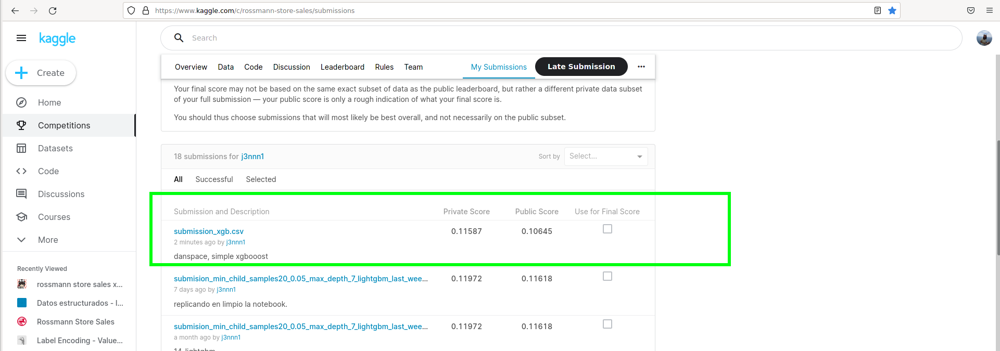
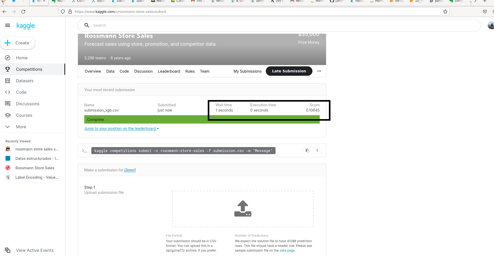

# rossman_lightgbm

# branch: main contiene modelo con lightgbm

# branch: branch xgboost_2 contiene modelo con xgboost 

Tomado de: https://www.kaggle.com/danspace/rossmann-store-sales-xgboost

pip install seaborn
pip install xgboost

